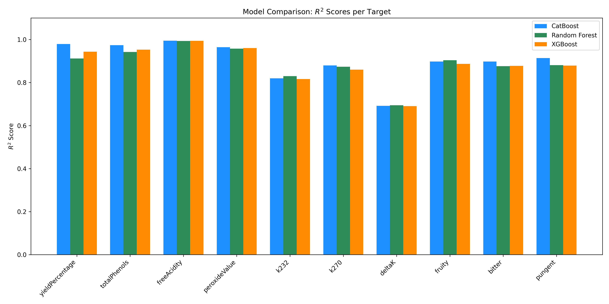
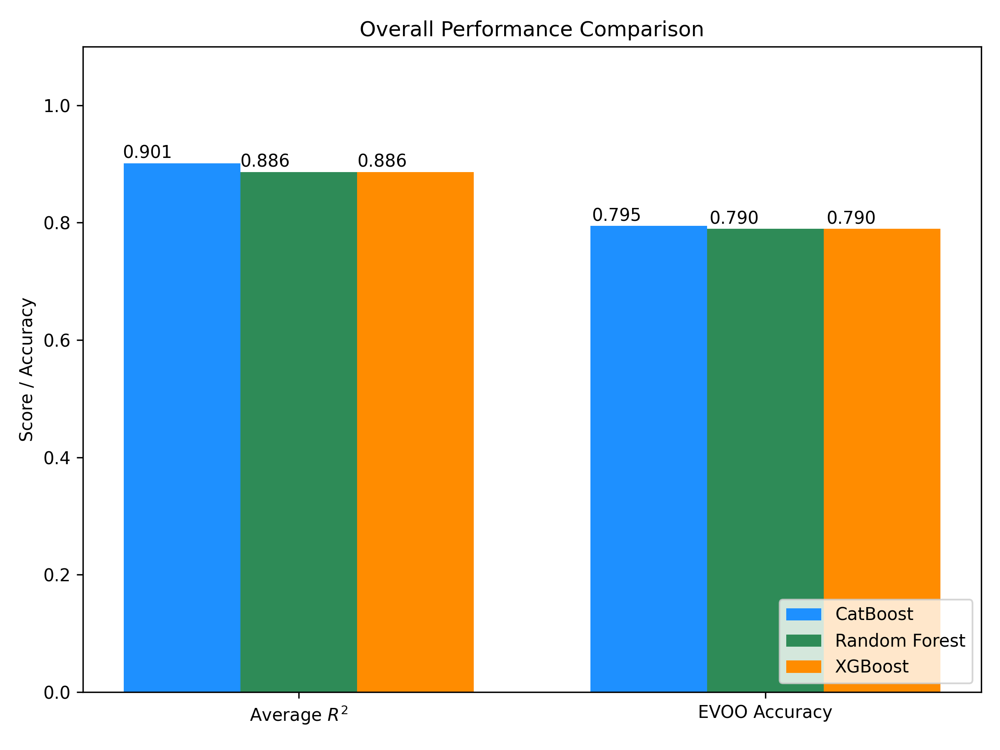

# Machine Learning Model Comparison Report

This report details the benchmarking of three gradient-boosted and tree-based ensemble models: **CatBoost**, **Random Forest**, and **XGBoost**.
All models were trained and tested using an **80% train / 20% test** split on the same synthetic dataset.

## Overall Metrics

| Model | Average $R^2$ | EVOO Compliance Accuracy |
|---|---|---|
| CatBoost | 0.9012 | 79.50% |
| RandomForest | 0.8862 | 79.00% |
| XGBoost | 0.8861 | 79.00% |

## Target-Specific $R^2$ Scores

| Target | CatBoost | Random Forest | XGBoost |
|---|---|---|---|
| yieldPercentage | 0.9789 | 0.9117 | 0.9437 |
| totalPhenols | 0.9738 | 0.9421 | 0.9525 |
| freeAcidity | 0.9948 | 0.9934 | 0.9941 |
| peroxideValue | 0.9643 | 0.9574 | 0.9603 |
| k232 | 0.8199 | 0.8295 | 0.8160 |
| k270 | 0.8793 | 0.8734 | 0.8604 |
| deltaK | 0.6916 | 0.6944 | 0.6908 |
| fruity | 0.8975 | 0.9036 | 0.8872 |
| bitter | 0.8978 | 0.8758 | 0.8774 |
| pungent | 0.9140 | 0.8808 | 0.8791 |

## Visualizations

### Target $R^2$ Comparison

### Overall Performance

## Conclusion
The results indicate that all three models perform exceptionally well on the synthetic dataset, capturing the nonlinear relationships with high fidelity. The minor variations in the average $R^2$ score and identical EVOO compliance accuracy across the ensembles suggest robust modeling. However, **CatBoost** remains highly favorable due to its native handling of categorical features, avoiding the need for manual one-hot encoding or type casting necessary in Random Forest and XGBoost.
